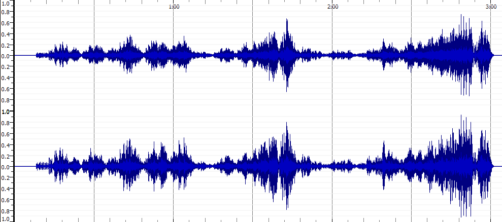
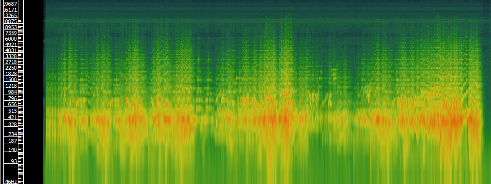
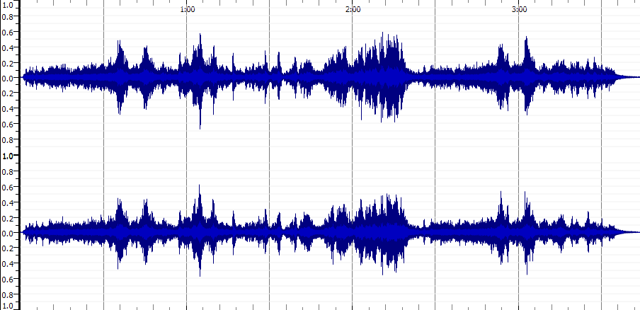
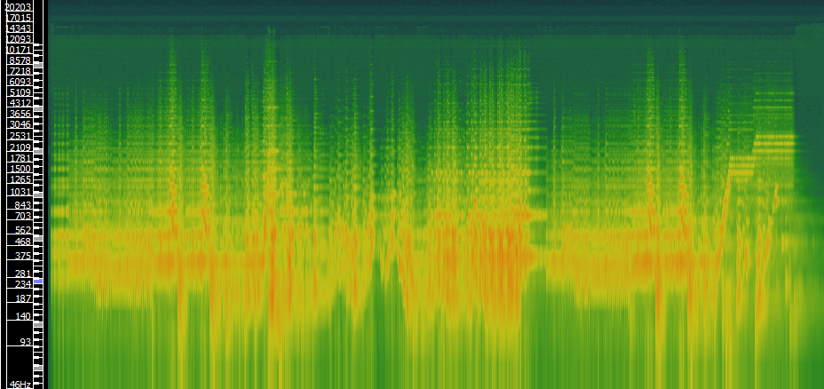
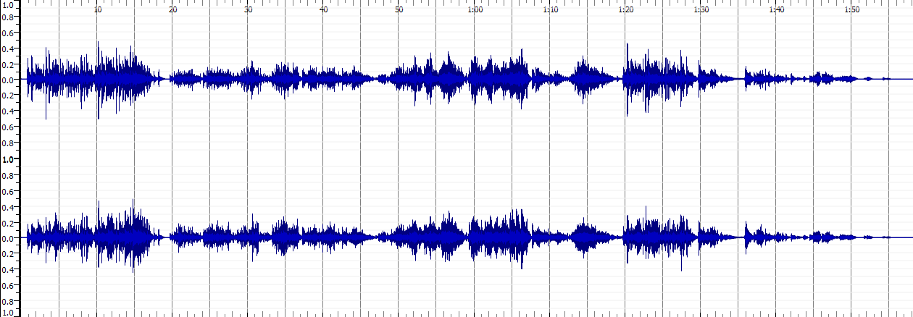
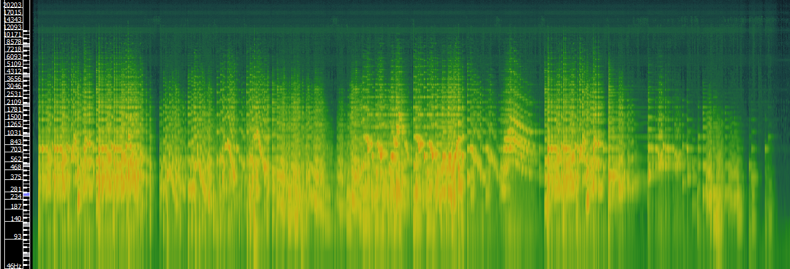

# Charlie Curtis MCA Project
my page

new paragraph 

## Week 1 Write Up

In my experience the challenges of working with music and music related data are situated in the finding of accurate and legitimate notated data. In terms of distribution both too much and too little can be a problem. Too much distribution can inevitably lead to studying or taking data off of a score that is inaccurate. Too little distribution can make it hard to find the data in the first place. This relates to my selected theme, the orchestral work of Debussy, as many different versions of his work exist online. Amongst this there are also various transcriptions and arrangements of his work too. Finding a clear and accurate score amongst the illegitimate ones can be difficult. In addition, as he is a very popular composer there are many different recordings and versions of acoustic data available. Too much choice and too many variations can make it hard to find a precise version. 

Debussy’s work is well documented and recorded. All of his scores are available in the public domain and are on imslp. Many recordings made of his work are on spotify. IMSLP also contains metadata on Debussy’s work.

## Week 2 Write Up

I started by thinking I would try to transcribe a Debussy Orchestral work, but on discussion with Josh I realized this would be hard to pursue later down the line due to transposing instruments. I then went for a debussy piece for cello and piano, The Cello Sonata prologue. But when I imported it into Musescore the score was almost unrecognisable, parts had been stretched out and voice parts had been added randomly. I thought it best to choose a simpler piece.

I ended up choosing Debussy's L51. The pdf imported well enough aside from the fact that it was in 2/4 whereas the original score is in 3/4. When I tried to convert it to 3/4 Musescore crashed. So I started switching the score to 3/4 in small chunks, working backwards. Josh then told me I could just do 20 bars which I easily converted. There were then not many changes to make to the score apart from the odd duration issue, missing note or missing articulations and dynamics. 

## Week 3 Write Up

[Verovio MEI Score and Write Up](https://charlietfc.github.io/MCA-2022/verovio.html)

## Week 4 Write Up

 

## Week 5 Write Up

Choosing a metadata schema: the choices of metadata I opted for was decided based on a combination of what I thought was necessary and the information I had available to me for the specific work I chose - Debussy's Valse Romantique 
these were the options I went for:
<styleName> - within <title>, indicates genre
<respStmt> - to give my name as having encoded the file 
<distributor> - within the <pubStmt> - gives describition of English distributor of French publishing
<publisher> - gave French publisher
<address> - address of French publisher
<notesStmt> - to give information on licensing data 

## Week 8 Write Up

Waveform and Spectrogram for Valse Romantique, L. 71
 
 
 
 
 
Waveform and Spectrogram for Images I, L110: III. Mouvement 
 
 
 
 
 
### Waveform and Spectrogram for Danse Bohémienne, L. 9
 
 
 
 
 
 
 
 
 
 
