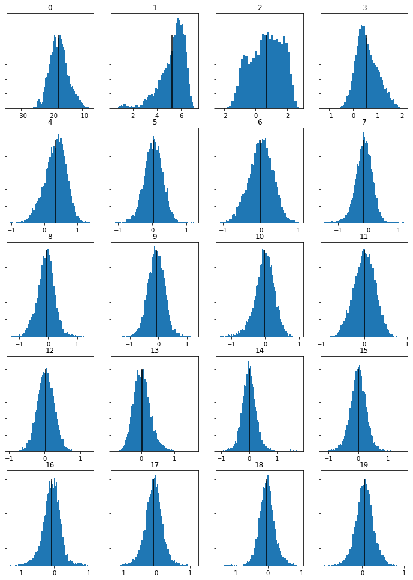
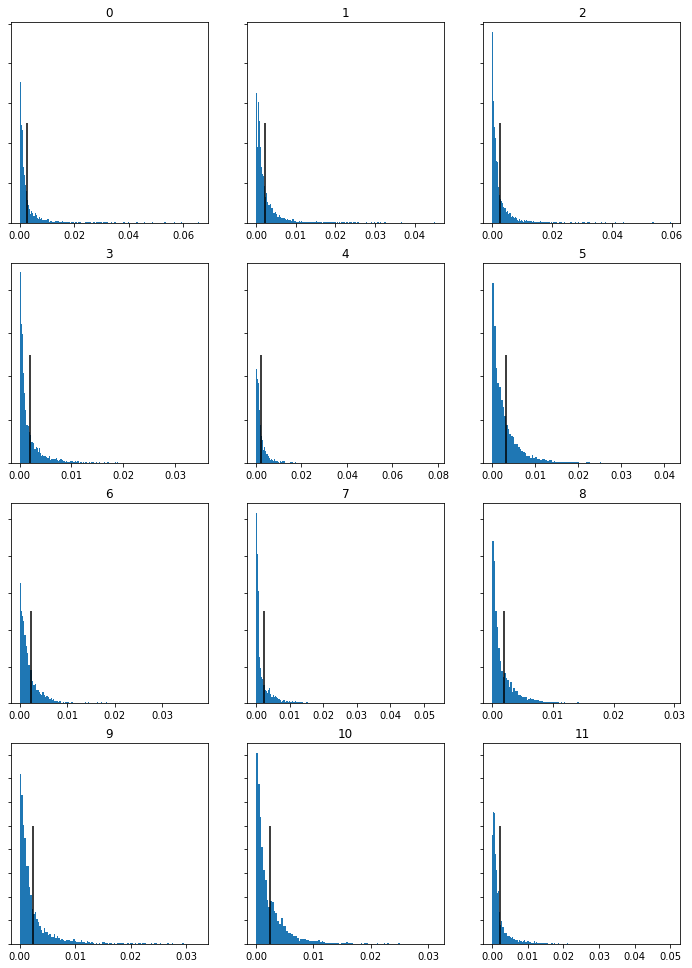
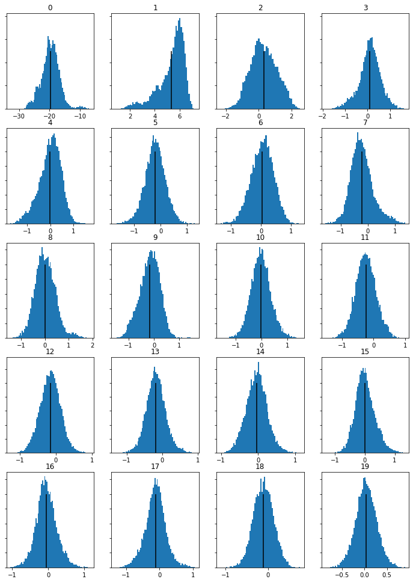
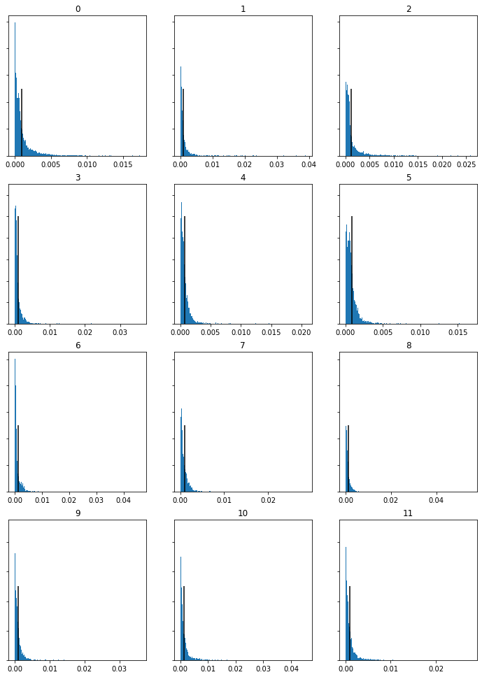
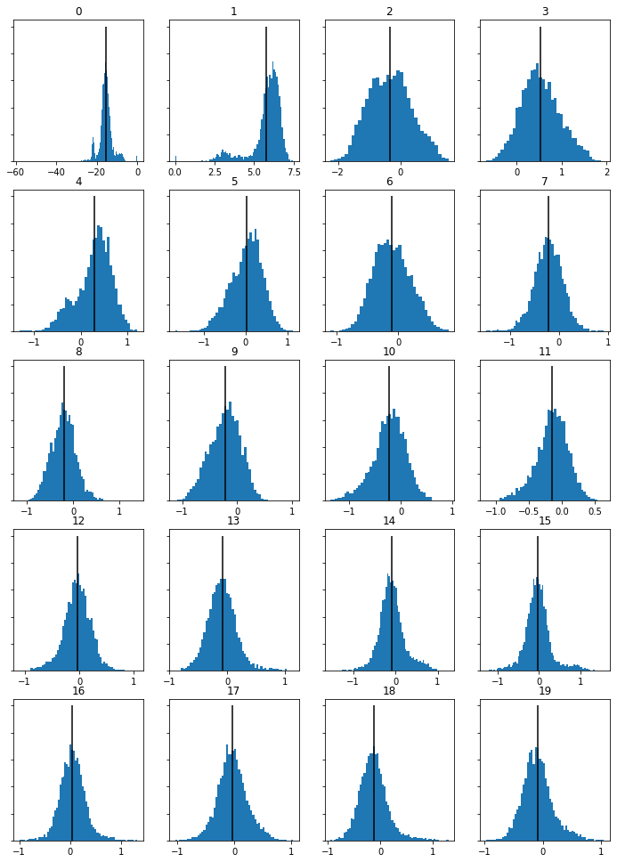
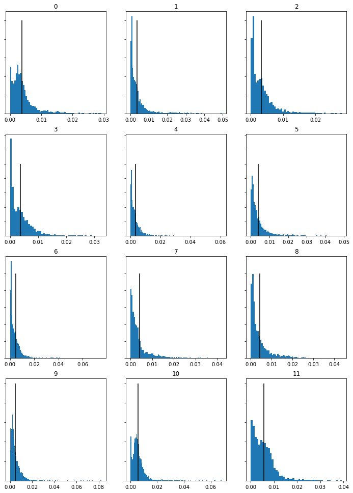
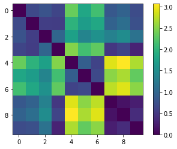
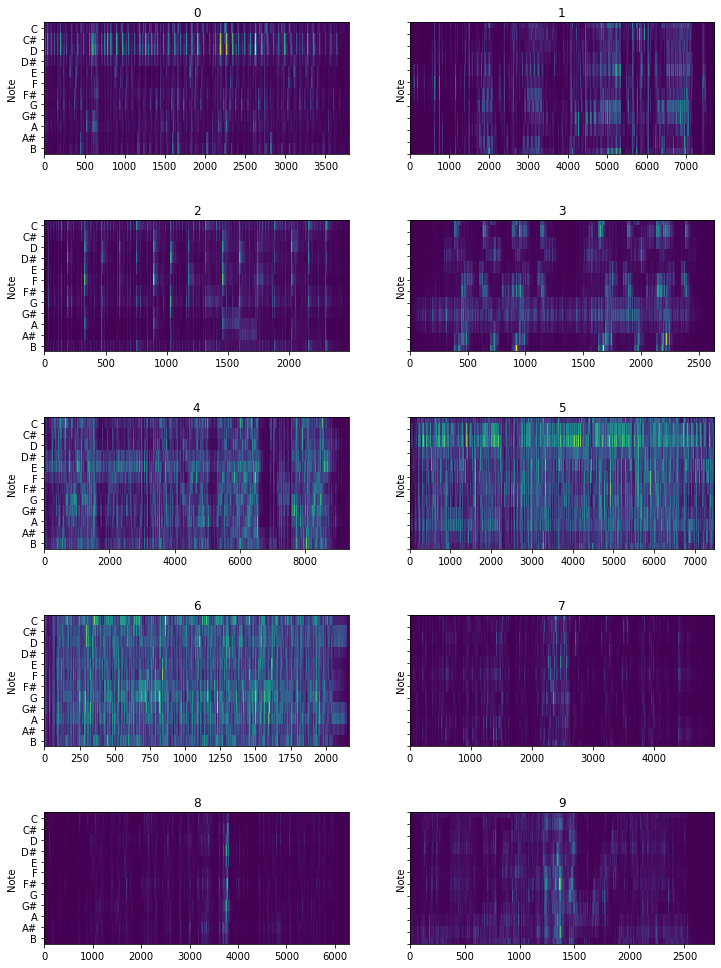
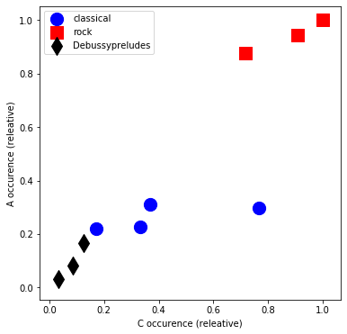

# Charlie Curtis MCA Project

[__WEEK 1__](https://charlietfc.github.io/MCA-2022/#week-1-write-up) | [__WEEK 2__](https://charlietfc.github.io/MCA-2022/#week-2-write-up) | [__WEEK 3__](https://charlietfc.github.io/MCA-2022/#week-3-write-up) | [__WEEK 4__](https://charlietfc.github.io/MCA-2022/#week-4-write-up) | [__WEEK 5__](https://charlietfc.github.io/MCA-2022/#week-5-write-up) | [__WEEK 7__](https://charlietfc.github.io/MCA-2022/#week-7-write-up) | [__WEEK 8__](https://charlietfc.github.io/MCA-2022/#week-8-write-up) | [__WEEK 9__](https://charlietfc.github.io/MCA-2022/#week-9-write-up) | [__WEEK 10__](https://charlietfc.github.io/MCA-2022/#week-10-write-up)

## Week 1 Write Up

In my experience the challenges of working with music and music related data are situated in the finding of accurate and legitimate notated data. In terms of distribution both too much and too little can be a problem. Too much distribution can inevitably lead to studying or taking data off of a score that is inaccurate. Too little distribution can make it hard to find the data in the first place. This relates to my selected theme, the orchestral work of Debussy, as many different versions of his work exist online. Amongst this there are also various transcriptions and arrangements of his work too. Finding a clear and accurate score amongst the illegitimate ones can be difficult. In addition, as he is a very popular composer there are many different recordings and versions of acoustic data available. Too much choice and too many variations can make it hard to find a precise version. 

Debussy’s work is well documented and recorded. All of his scores are available in the public domain and are on imslp. Many recordings made of his work are on spotify. IMSLP also contains metadata on Debussy’s work.

## Week 2 Write Up

I started by thinking I would try to transcribe a Debussy Orchestral work, but on discussion with Josh I realized this would be hard to pursue later down the line due to transposing instruments. I then went for a debussy piece for cello and piano, The Cello Sonata prologue. But when I imported it into Musescore the score was almost unrecognisable, parts had been stretched out and voice parts had been added randomly. I thought it best to choose a simpler piece.

I ended up choosing Debussy's L51. The pdf imported well enough aside from the fact that it was in 2/4 whereas the original score is in 3/4. When I tried to convert it to 3/4 Musescore crashed. So I started switching the score to 3/4 in small chunks, working backwards. Josh then told me I could just do 20 bars which I easily converted. There were then not many changes to make to the score apart from the odd duration issue, missing note or missing articulations and dynamics. Later on I went back to change it to just 10 bars, I had to edit these myself but the basis was from the Musescore Transcription 

### 10 Bars of Debussy's Valse Romantique
[Download Link](https://github.com/charlietfc/MCA-2022/blob/master/Debussy_Valsefr.mscz)

## Week 3 Write Up

[Verovio MEI Score and Write Up](https://charlietfc.github.io/MCA-2022/verovio.html)

## Week 4 Write Up

 

## Week 5 Write Up

Choosing a metadata schema: the choices of metadata I opted for was decided based on a combination of what I thought was necessary and the information I had available to me for the specific work I chose - Debussy's Valse Romantique 
these were the options I went for:

styleName - within 'title', indicates genre

respStmt - to give my name as having encoded the file 

persName - to give the composer's name 

distributor - within 'pubStmt' - gives describition of English distributor of French publishing

date - the date the piece was released 

publisher - gave French publisher

address - address of French publisher

notesStmt - to give information on licensing data 

## Week 7 Write Up

[Verovio Website With Metadata](https://charlietfc.github.io/MCA-2022/CCCss.html)

Here is my Verovio Website with the updated and formatted Metadata. As is visible I couldn't quite line everything up but the basic ideas are there. I did have to go back to edit the MEI file as it sometimes wasn't clear, such as with the publisher and the distributor, what the metadata was actually referring to. Therefore I had to add descriptive names in the MEI code.

## Week 8 Write Up

### Waveform and Spectrogram for Valse Romantique, L. 71
 
 
 
 
 
### Waveform and Spectrogram for Images I, L110: III. Mouvement 
 
 
 
 
 
### Waveform and Spectrogram for Danse Bohémienne, L. 9
 
 
 
 
 
 An advantage of time frequency analysis over waveform analysis is that you can notice specifically 'musical' occurences within the piece through just a quick glance at the time frequency spectrogram. 'Musical' is obviously a broad term and in this context I mean something that would relate to the actual notes being played within the piece of music. For example in the time frequency spectrogram of Images I, L110: III. Mouvement it is easy to spot, near the end of the piece, an ascending phrase as a diagonal red line is showed on the graph. This would be very difficult to decode through the waveform. Another advantage is that the time frequency spectrogram shows the formants within the piece of music, these are noticeable in all of the graphs. As each of these pieces contain solo piano there is not huge variation in the formants shown, yet they are still interesting to observe as opposed to the waveforms which don't show them at all.
 
## Week 9 Write Up

### 20 MFCC Histograms and 12 Chromagram Histograms for Prelude 1. Danseuses de Delphes. L. 117

 

 
 
 ### Prelude 2. Voiles. L. 117
 
 

 
 
 ### Prelude 3. Le Vent Dans le Plaine. L. 117
 
 

 
 
 
 
## Week 10 Write Up

### Debussy Preludes Similarity Graphs

### Debussy Valse Romantique Transcription Comparison 

#### Original Transcription 

#### Sonic Visualiser Transcription 

It is clear from 

 
 
 
 
